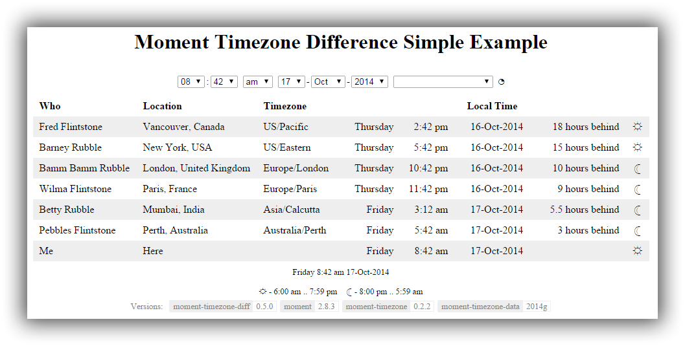
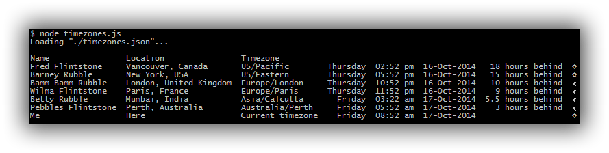

# Moment Timezone Difference

To use moment-timezone-diff, you will need [moment@2.8.3+](http://momentjs.com/), [moment-timezone@0.2.2](http://momentjs.com/timezone/), and the [moment-timezone](http://momentjs.com/timezone/) data.

## Browser

Include the [moment](http://momentjs.com/) and [moment-timezone](http://momentjs.com/timezone/) files, and then include *moment-timezone-diff.js*.

	
	
	
	<link href="moment-timezone-diff.css" rel="stylesheet" type="text/css" />

See [moment-timezone](http://momentjs.com/timezone/).

## Node.js

Include the [moment-timezone](http://momentjs.com/timezone/) files, and then include *moment-timezone-diff.js*.

	var moment = require('moment-timezone'),
		momentTimezoneDiff = require('moment-timezone-diff');

## Files

File | Description
---- | -----------
moment-timezone-diff.js | File containing the Javascript for momentTimezoneDiff functionality.
moment-timezone-diff.css | File containing default styles for the HTML elements created by momentTimezoneDiff. 

# Timezones

Timezone information is maintained by [iana](http://www.iana.org/time-zones), which is used by [moment-timezone](http://momentjs.com/timezone/) to provide a simple enough way to access the information.

What does one use for a timezone value? Checkout the interactive map provided by [moment-timezone](http://momentjs.com/timezone/).  You will not be disappointed.

# momentTimezoneDiff Namespace

The *momentTimezoneDiff* namespace allows access to the top-level properties, methods and classes. 

Name | Type | Description
-----|------|------------
version | String | Version of moment-timezone-diff.js
MODE_TEXTBOX | Number | Date time elements use a single text box for the date & time.
MODE_DROPDOWN_HOUR24 | Number | Date time elements use multiple drop down controls for date & time where hours is expressed using the 24 hour clock.
MODE_DROPDOWN_HOUR12 | Number | Date time elements use multiple drop down controls for date & time where hours is expressed using the 12 hour clock.
DATE_ORDER_DMY | Number | Date drop down controls are ordered day, month and year.
DATE_ORDER_MDY | Number | Date drop down controls are ordered month, day and year.
DATE_ORDER_YMD | Number | Date drop down controls are ordered year, month & day.
Environment | Class Constructor | Creates a new timezone difference environment within an HTML page. Browser only.
DateTimeElements | Class Constructor | Creates a new timezone difference date & time controls within an HTML page. Browser only.
TimezoneDiff | Class Constructor | Allows calculation of the difference between two timezones for a given moment in time.
getDefaultTimezone | function| Gets a valid timezone which best matches the current timezone.
getOptions | function | Gets a copy of the current options.
setOptions | function | Sets one or more option properties.
daytime | function | Determines whether a given moment is in the daytime.
createLegend | function | Returns an array of strings which present the legend. 

## version

	String momentTimezoneDiff.version

Returns the version of **momentTimezoneDiff**.

## getDefaultTimezone

	String momentTimezoneDiff.getDefaultTimeZone()

Uses logic incorporated from [tzdetect](https://github.com/Canop/tzdetect.js) to provide a timezone which best represents the user's current timezone.

## getOptions

	Object momentTimezoneDiff.getOptions()

Returns a copy of the default options, which are used when creating Environment, DateTimeElements and TimezoneDiff objects, should options not be explicitly specified.

## setOptions

	momentTimezoneDiff.setOptions(Object options)

Sets the default option values to those specified within the *options* parameter.

## daytime

	Boolean momentTimezoneDiff.daytime(Moment moment, [Object options])

For a given moment and option values, returns whether the time of day presents daytime, as determined by the configured sunrise and sunset times.  See options sunRiseHour, sunRiseMinute, sunSetHour & sunSetMinute values for more information.  If *options * is not specified, the namespace's default options are used.

## createLegend

	Array momentTimezoneDiff.createLegend([Object options])

For the given options, returns an array of String values which show the daytime and nighttime times   If *options * is not specified, the namespace's default options are used. 

For example:

	[
	  'Daytime - 6:00 am .. 7:59 pm', 
	  'Nighttime - 8:00 pm .. 5:59 am' 
    ]

## getVersionInfo

	Array getVersionInfo(Object options);

Returns an array of information for each component used and its version number.

For example:

    [
      { 'name': 'moment-timezone-diff', 'link': 'https://github.com/MartynDavis/moment-timezone-diff/', 'versionNumber': '0.5.0'},
      { 'name': 'moment', 'link': 'http://momentjs.com/', 'versionNumber': '2.8.3' },
      { 'name': 'moment-timezone', 'link': 'http://momentjs.com/timezone/', 'versionNumber': '0.2.2' },
      { 'name': 'moment-timezone-data', 'link': 'http://momentjs.com/timezone/', 'versionNumber': '2014g' }
      { 'name': 'jQuery', 'link': 'https://jquery.com/', 'versionNumber': '1.10.2' });
      { 'name': 'jQuery-UI', 'link': 'https://jqueryui.com/', 'versionNumber': '1.11.1' }
    ]

## displayVersionInfo

	displayVersionInfo(String id, Object options);

Displays the version information within the HTML element identified by the **id** value. 

## Options

The moment-timezone-diff namespace default options are used to control the behaviour of the Environment, DateTimeElements and TimezoneDiff objects, unless overridden at creation time.

Name | Description
-----|------------
locale | The moment locale to be used. Default: *undefined*
ahead | The string to use when the timezone is ahead of the referenced moment's timezone. Default: 'ahead'
behind | The string to use when the timezone is behind the referenced moment's timezone.  Default: 'behind'
hour | The string to use for a single hour.  Default: 'hour'
hours | The string to use for mulitple hours. Default:  'hours'
sunRiseHour | The hour of sunrise.  Default:  6
sunRiseMinute | The minute of sunrise.  Default:  0
sunSetHour | The hour of sunset.  Default:  20
sunSetMinute | The minute of sunset.  Default:  0
daytime | The string to use to represent daytime.  The default is the unicode character depicting a white sun with rays &#x263c; is used. Default: '\u263c'
nighttime | The string to use to represent nighttime. The default is the unicode character depicting the last quarter moon &#x263e; is used. Default: '\u263e'
legendFormat | The moment format to use within the legend for sunrise and sunset.  Default:  'h:mm a'
legendBreak | Whether to insert a break between the sunrise and sunset legend information  Default:  false
legendDash | The string inserted between the daytime/nighttime string and the sunrise and sunset range.  Default:  ' - '
legendSeparator | The string inserted between the sunrise and sunset times.  Default:  ' .. '
timeFormat | The moment format to use to display the time for which the environment is referencing.  Default:  'dddd h:mm a DD-MMM-YYYY'
timeShowTimezoneName | Whether to show the timezone associated name instead of the actual timezone within the environment's dislayed time. Default:  false
defaultTimezone | The default timezone to be used, should the data contain a blank timezone.  Default:  getDefaultTimezone()
versionClass | The class of the element which contains the name and version elements. Default: 'mtzdVersion',
versionTitle | The caption to display before the version information. Default: 'Versions:',
versionTitleClass | The class for the version title. Default: 'mtzdVersionTitle',
versionNameClass | The class to use for the name of the component used. Default: 'mtzdVersionName',
versionVersionClass | The class to use for the version value. Default: 'mtzdVersionVersion',
versionIncludeLinks | Whether to include the link within the version information. Default: true,
versionLinkTarget | The target of the link within the version information. Default: '_blank',
versionIncludejQuery | Whether to include the jQuery and jQuery UI version information, if present. Default: true

## Example

The following options will ensure that all information is displayed in French.

	options = { locale: 'fr',
	            sunRiseHour: 8,
	            sunSetHour: 16,
	            ahead: 'devant',
	            behind: 'derrière',
	            hour: 'heure',
	            hours: 'heures'
              };

# Environment Class

The environment class allows for a self contained environment to be created within an HTML page.

## Constructor

	momentTimezoneDiff.Environment(Object options);

The following option values control how the environment is created:

Name | Description
-----|------------
dateTimeElements | A reference to an existing DateTimeElements object to be used. Default: *undefined*
dateId | The id of the element to be used against which the DateTimeElements object is created, using dteOptions if specified. Only used if 'dateTimeElements' is not defined.  Explcitly set this value to undefined if a DateTimeElements is not to be used. Default: 'mtzdDate'
formatsId | The id of the element which contains information about the formats to be used. Default: 'mtzdFormats'
containerId | The id of the element which contains the rows and columns to be populated. Default: 'mtzdContainer'
timeId | The id of the element which displays the time referenced. Default: 'mtzdTime'
legendId  | The id of the element which displays the legend information. Default: 'mtzdLegend'
tokenSeparator | The character to use to separate the tokens used within the formats element. Default: '&#124;'
linkClass | The class to use when a link is added to an element to change the timezone within the DateTimeElements object. Default: 'mtzdLink'
legendClass | The class of the legend elements which contains textual information. Default: 'mtzdLegend'
legendBreakClass | The class of the legend which contains the break within the legend. Default: 'mtzdLegendBreak'
autoRefresh | Whether the environment is refreshed with information for the current time. Default: true
autoUpdate | Whether the environment is to automatically update every minute to reflect the current time. Default: false
autoUpdateSeconds | The update frequency, should 'autoUpdate' be enabled. Default: 30

The namespace default option values can also be overriden via the *options* parameter.

## HTML Elements

The environment uses the names of the following elements:

### dateId

The id of the element which is to contain the created date & time elements.

Typically this will be a **div**.

### formatsId

The id of the element which contains, as children, elements which contain the formats of each of the main container's 'columns'.  The textContent of each of the children is used as the format value.

The structure of the format value is one or more tokens separated by the '&#124;' character (which can be changed using 'options.tokenSeparator').

Each token can be one of the following:

Token | Description
----- | -----------
NAME | The name associated with the container 'row'.
DESCRIPTION | The description associated with the container 'row'.  This is used within the tooltip (HTML title) if specified.
TIMEZONE | The timezone associated with the container 'row'.
TOOLTIP | The 'column' within the container 'row' will have its 'title' set to "DESCRIPTION\nTIMEZONE" or "TIMEZONE".
Everything else | Everything else is considered to be a Moment.format() string.  See http://momentjs.com/docs/#/displaying/ for a full description on the supported formats.

At a minimum, the 'formatsId' element must contain two 'columns'.  The first being the required timezone, and the second being a Moment.format() string.

### containerId

The id of the element which contains, as children & grandchildren, elements which contain the 'rows' and 'columns' of the data to be used.

### timeId

The id of the element which is used to display the date & time currently selected.

### legendId

The id of the element which is to contain the legend information.  The legend shows the time periods for daytime and nighttime.

## refresh

	Environment.refresh();

Updates the DateTimeElements controls, if present, and Environment values as per current moment and timezone values.

## update

	Environment.update(Object value, String timezone, [String name]);

Updates the current moment and timezone values for the given date/time *value*, *timezone* and *name*.

If name is not specified, then the name is looked up within the environment's DateTimeElements object.  If the environment's DateTimeElements object is not defined, then name is set to the timezone value.

The *value* value can be either of the following:

Value | Description
------|------------
Moment | moment() value
Date | Javascript Date object
Number Array | An array of numbers presenting year (full 4 digit year value), month (0..11), day (1..31), hour (0..23) and minute (0..59).

## setCurrentTime

	Environment.setCurrentTime();

Sets the moment and timezone values to be the user's current time & timezone.

## setTimezone

	Environment.setCurrentTime(String timezone, [String name]);

Sets the current timezone, and name, to the specified values.

If name is not specified, then the name is looked up within the environment's DateTimeElements object.  If the environment's DateTimeElements object is not defined, then name is set to the timezone value.

## getOptions

	Object Environment.getOptions();

Returns a copy of the environment's configured options.

## setOptions

	Environment.getOptions(Object options);

Allows one or more of the environment's configured option values to be overridden.

## daytime

	Boolean Environment.daytime(Moment moment);

Returns whether the supplied moment occurs during the daytime, as per the environment's configured options.

## createLegend

	Array Environment.createLegend();

Returns an array of String values which present the environment's legend, as per the environment's configured options.

# DateTimeElements Class

The DateTimeElements class is responsible for creating the date & time HTML controls required to allow selection of the date, time and timezone information.

## Constructor

	Object DateTimeElements(Object options);

The following options are supported:

Name | Description
---- | -----------
timeDelim | The delimiter displayed between the hour and minute. Default: ':'
dateDelim | The delimiter displayed between the day, month and year. Default: '-'
hourFormat | The format of the hour to be used.  Default: 'h' (MODE_TEXTBOX), 'hh' (MODE_DROPDOWN_HOUR12) or 'HH' (MODE_DROPDOWN_HOUR24)
minuteFormat | The format of the minute to be used. Default: 'mm'
ampmFormat | The format of the am/pm 12 hour suffix to be used. Default: 'a'
yearFormat | The format of the year to be used. Default: 'YYYY'
monthFormat | The format of the month to be used. Default: 'MMM'
dayFormat | The format of the day of month to be used. Default: 'D' (MODE_TEXTBOX) or 'DD' (MODE_DROPDOWN_HOUR12 or MODE_DROPDOWN_HOUR24)
dateOrder | The order of the day, month and year controls. Default: DATE_ORDER_DMY
minYear | The minimum year supported. Default: 2010
maxYear | The maximum year supported. Default: 2020
locale | The locale to be used to localise the moment().format() routine. Default: undefined
timeDisplayFormat | When MODE_TEXTBOX is selected, the format of teh date & time displayed within the text box. Default: format
timeInputFormats |  Default: An array of timeDisplayFormat and 12 and 24 hour variants.
timeTitle |  Default: 'Enter the required date and time.'
timeTitleShowInputFormats | Whether to include the supported input formats within the textbox tooltip. Default: true {
timeTitleInputFormats | The prefix within the textbox tooltip for the sypported input formats. Default: 'Supported formats are:'
inputClass | The class used for the textbox INPUT element. Default: 'mtzdInput' 
size | The size of the textbox INPUT element on the page. Default: 18 
maxlength | The maximum length of text allowed within the textbox INTPUT element. Default: 255 
hourTitle | The tooltip of the hour SELECT element. Default: 'Select hour of the day'
selectClass | The class used for the SELECT elements. Default: 'mtzdSelect'
timeDelimClass | The class used for the time delimiter text. Default: 'mtzdTimeDelim'
minuteTitle | The tooltip of the minute SELECT element. Default: 'Select minute of the hour'
delimClass | The class used for the space used to delim the time, date, timezone and current time elements. Default: 'mtzdDelim'
ampmTitle | The tooltip of the am/pm SELECT element. Default: 'Select morning or afternoon'
dateDelimClass | The class used for the date delimiter text. Default: 'mtzdDateDelim'
dayTitle | The tooltip of the month SELECT element. Default: 'Select day of the month'
monthTitle |  Default: 'Select month of the year'
yearTitle |  Default: 'Select year'
datepickerLocale | The locale to use for the jQuery datapicker UI control. Default: undefined
datepickerClass | The class to use for the HTML INPUT element associated with the jQuery datapicker UI control.  By default this element is hidden, and managed by momentTimezoneDiff. Default: 'mtzdDatepicker'
datepickerImageClass | The class for the image used to trigger the jQuery datepicker control. Default: 'mtzdDatepickerImage'
datepickerTitle | The tooltip of the image used to trigger the jQuery datepicker control. Default: 'Select the date using a calendar'
datepickerImage | The image displayed to trigger the jQuery datepicker control. Default: 'data:image/png;base64,iVBORw...VORK5CYII=' 
timezoneTitle |  Default: 'Select timezone'
currentTimezoneText | The text within the timezone dropdown combo element associated with the current timezone. Default: ''
showCurrentTime | Whether the current time option is visible within the DateTimeElements. Default: true
currentTime | The text to display for the current time.  The default is the unicode character depicting a circle with the top right quarter in black &#x25d4; is used. Default: '\u25d4'
currentTimeTitle | The tooltip displayed for the current time. Default: 'Current Time'
currentTimeClass | The class used for the current time. Default: 'mtzdCurrentTime'
errorClass | The class which is used to highlight an invalid time and date entered for MODE_TEXTBOX.  The default is to shade the textbox background yellow when an invalid time and date is entered. Default: 'mtzdError'

## addTimezone

	DateTimeElements.addTimezone(String timezone, [String name]);

Adds the timezone to the timezone dropdown combo SELECT element, where timezone is the element value, and name is the element text displayed to the user.

If **name** is not specified, then the timezone value is used.

If the timezone and name already exist within the timezone element, it is not added again.

## getTimezoneName

	String DateTimeElements.getTimezoneName(String timezone);

For a given timezone, the associated name, ie associated text, within the timezone element is returned.

If the timezone is present within the timezone element multiple times, ie with different names, the first name is returned.

## getSelected

	Object DateTimeElements.getSelected();

Returns an object which represents the time, date and timezone values selected.

	{
		'hour': 12,
		'minute': 42,
		'day': 8,
		'month': 1,
		'year': '2014',
		'timezone': {
					  value: 'US/Pacific',
					  text: 'Vancouver, Canada'
				    }
	}

## getSelectedDate

	Date DateTimeElements.getSelectedDate();

Returns a Date object which represents the time and date values selected.

## setSelected

	DateTimeElements.setSelected(Object selected);

Given an object, which is structured in the same manner as that returned by getSelected(), the time, date and timezone HTML elements are updated to reflect the new values.

## setCurrentTime

	DateTimeElements.setCurrentTime();

Sets the time, date and timezone HTML elements to reflect the current time.

## registerCallback

	DateTimeElements.registerCallback(Function callback);

Registers a callback function which is invoked whenever the time, date or timezone values are updated.

The callback function has the following parameters:

	function callback(Object selected) {
		// Update information based on selected values
	}

The selected Object is structured in the same manner as that returned by getSelected().

# TimezoneDiff Class

The TimezoneDiff class is used to allow the time difference between two timezones to be calculated for a  given moment.

## Constructor

	TimezoneDiff(Moment momentReference, String timezone, Object options);

The referenced moment denoted by momentReference already has its timezone set.

Name | Description
-----|------------
locale | The moment locale to be used. Default: *undefined*
ahead | The string to use when the timezone is ahead of the referenced moment's timezone. Default: 'ahead'
behind | The string to use when the timezone is behind the referenced moment's timezone.  Default: 'behind'
hour | The string to use for a single hour.  Default: 'hour'
hours | The string to use for mulitple hours. Default:  'hours'
sunRiseHour | The hour of sunrise.  Default:  6
sunRiseMinute | The minute of sunrise.  Default:  0
sunSetHour | The hour of sunset.  Default:  20
sunSetMinute | The minute of sunset.  Default:  0
daytime | The string to use to represent daytime.  The default is the unicode character depicting a white sun with rays &#x263c; is used. Default: '\u263c'
nighttime | The string to use to represent nighttime. The default is the unicode character depicting the last quarter moon &#x263e; is used. Default: '\u263e'

## diff

	Number TimezoneDiff.diff();

Returns the number of hours different between the referenced moment timezone and specified timezone.

## dayDiff

	Number TimezoneDiff.diff();

Returns the number of days different between the referenced moment timezone and specified timezone.

This will be either -1, 0 or 1.

## daytime

	Boolean TimezoneDiff.daytime();

Returns whether the referenced moment for the specified timezone occurs during the daytime.

## getOptions

	Object TimezoneDiff.getOptions();

Returns a copy of the currently configured options.

## setOptions

	TimezoneDiff.setOptions(Object options);

Allows one or more option values to be overridden.

## format

	String TimezoneDiff.format(String format);

The **format** is the Moment.format() string, which has the following tokens added:

Token | Description
----- | -----------
DIFF | Displays the hourly difference as either '5 hours behind', or '1 hour ahead'
diff | Displays the hourly difference as either '-5 hours', or '1 hour'
daynight | Displays the daytime or nighttime string.

If you want to display 'DIFF', 'diff' or 'daynight' within formatted string, then you escape these using the standard Moment.format() escape characters '[' & ']'.

Example format strings for the following values:

- Referenced moment Thursday 5:45 pm 16-Oct-2014 within timezone 'US/Pacific'.
- Timezone 'Australia/Melbourne' 

Format String | Output
--------------| ------
dddd h:mm a DD-MMM-YYYY DIFF daynight | Friday 11:45 am 17-Oct-2014 18 hours ahead &#x263c;
dddd | Friday
h:mm a | 11:45 am
DD-MMM-YYYY | 17-Oct-2014
DIFF | 18 hours ahead
daynight | &#x263c;

# Example

## HTML

The following example is contained within [examples/simple.html](examples/simple.html).

### simple.html

    <!DOCTYPE html>
    <html>
    <head>
    <meta charset="utf-8">
    <link href="http://code.jquery.com/ui/1.11.1/themes/smoothness/jquery-ui.css" rel="stylesheet" type="text/css" />
    
    
    
    
    
    <link href="../scripts/moment-timezone-diff.css" rel="stylesheet" type="text/css" />
    <title>Moment Timezone Difference Simple Example</title>
    
    
    </head>
    <body onload='initialise();'>
        <h1>Moment Timezone Difference Simple Example</h1>
        

        

        

            <table>
                <thead>
                    <tr>
                        <th class='name'>Who</th>
                        <th class='location'>Location</th>
                        <th class='timezone'>Timezone</th>
                        <th colspan='5'>Local Time</th>
                    </tr>
                    <tr class='hide' id='mtzdFormats'>
                        <th>LINK|NAME</th>
                        <th>LINK</th>
                        <th>LINK|TIMEZONE</th>
                        <th>dddd</th>
                        <th>h:mm a</th>
                        <th>DD-MMM-YYYY</th>
                        <th>DIFF</th>
                        <th>daynight</th>
                    </tr>
                </thead>
                <tbody id='mtzdContainer'>
                    <tr>
                        <td class='name'>Fred Flintstone</td>
                        <td class='location'>Vancouver, Canada</td>
                        <td class='timezone'>US/Pacific</td>
                        <td class='dayOfWeek'></td>
                        <td class='time'></td>
                        <td class='date'></td>
                        <td class='diff'></td>
                        <td class='daynight'></td>
                    </tr>
                    <tr>
                        <td class='name'>Barney Rubble</td>
                        <td class='location'>New York, USA</td>
                        <td class='timezone'>US/Eastern</td>
                        <td class='dayOfWeek'></td>
                        <td class='time'></td>
                        <td class='date'></td>
                        <td class='diff'></td>
                        <td class='daynight'></td>
                    </tr>
                    <tr>
                        <td class='name'>Bamm Bamm Rubble</td>
                        <td class='location'>London, United Kingdom</td>
                        <td class='timezone'>Europe/London</td>
                        <td class='dayOfWeek'></td>
                        <td class='time'></td>
                        <td class='date'></td>
                        <td class='diff'></td>
                        <td class='daynight'></td>
                    </tr>
                    <tr>
                        <td class='name'>Wilma Flintstone</td>
                        <td class='location'>Paris, France</td>
                        <td class='timezone'>Europe/Paris</td>
                        <td class='dayOfWeek'></td>
                        <td class='time'></td>
                        <td class='date'></td>
                        <td class='diff'></td>
                        <td class='daynight'></td>
                    </tr>
                    <tr>
                        <td class='name'>Betty Rubble</td>
                        <td class='location'>Mumbai, India</td>
                        <td class='timezone'>Asia/Calcutta</td>
                        <td class='dayOfWeek'></td>
                        <td class='time'></td>
                        <td class='date'></td>
                        <td class='diff'></td>
                        <td class='daynight'></td>
                    </tr>
                    <tr>
                        <td class='name'>Pebbles Flintstone</td>
                        <td class='location'>Perth, Australia</td>
                        <td class='timezone'>Australia/Perth</td>
                        <td class='dayOfWeek'></td>
                        <td class='time'></td>
                        <td class='date'></td>
                        <td class='diff'></td>
                        <td class='daynight'></td>
                    </tr>
                    <tr>
                        <td class='name'>Me</td>
                        <td class='location'>Here</td>
                        <td class='timezone'></td>
                        <td class='dayOfWeek'></td>
                        <td class='time'></td>
                        <td class='date'></td>
                        <td class='diff'></td>
                        <td class='daynight'></td>
                    </tr>
                </tbody>
                <tfoot>
                    <tr>
                        <td class='currentTime' id='mtzdTime' colspan='8'></td>
                    </tr>
                    <tr>
                        <td id='mtzdLegend' colspan='8'></td>
                    </tr>
                </tfoot>
            </table>
        

        

    </body>
    </html>

### Output

The HTML page will be rendered as the following:

You can see it live at [http://madlid.com/moment-timezone-diff/examples/simple.html](http://madlid.com/moment-timezone-diff/examples/simple.html).

## Node.js

The following example is contained within [node/timezone.js](node/timezone.js).

## timezone.js

    "use strict";
    var moment = require('moment-timezone'),
        momentTimezoneDiff = require('../scripts/moment-timezone-diff'),
        yargs = require('yargs'),
        fs = require('fs'),
        table = require('text-table');

    //
    // Parse command line options
    //
    var argv = yargs
        .usage('\nDisplay Timezone Related Information\n\nUsage: $0')
        .demand(0)
        .alias({ 'f': 'file' })
        .describe({ 'f': 'File containing configuration to load' })
        .string([ 'f' ])
        .defaults({ 'f': './timezones.json' })
        .strict(true)
        .argv;

    /*jslint nomen: true*/
    if (argv._.length !== 0) {
        /*jslint nomen: false*/
        yargs.showHelp();
        process.exit(1);
    }

    var file = argv.f,
        config,
        data = [ ],
        m = moment(),
        timezone,
        tzDiff,
        rowData,
        i,
        j,
        align,
        t;

    if (!fs.existsSync(file)) {
        console.error('File "' + file + '" does not exist');
        process.exit(1);
    }

    console.log('Loading "' + file + '"...');
    config = JSON.parse(fs.readFileSync(file, 'utf8'));

    if (!config.output) {
        config.output = [ "hh:mm a DD-MMM-YYYY DIFF daynight" ];
    }

    console.log();

    data.push([ 'Name', 'Location', 'Timezone' ]);

    for (i = 0; i < config.timezones.length; i++) {
        tzDiff = new momentTimezoneDiff.TimezoneDiff(m, config.timezones[i].timezone, config.options);
        
        rowData = [ config.timezones[i].name, config.timezones[i].location, config.timezones[i].timezone || 'Current timezone' ];
        
        for (j = 0; j < config.output.length; j++) {
            rowData.push(tzDiff.format(config.output[j]));
        }
        
        data.push(rowData);
    }

    align = [ 'l', 'l', 'l' ];

    for (j = 0; j < config.output.length; j++) {
        align.push('r');
    }
    t = table(data, { align: align });
    console.log(t);

## timezone.json

    {
        "options": { 
                   },
        "output": [ "dddd", 
                    "hh:mm a", 
                    "DD-MMM-YYYY", 
                    "DIFF", 
                    "daynight" 
                  ],
        "timezones": [ 
                        { "name": "Fred Flintstone", "location": "Vancouver, Canada", "timezone": "US/Pacific" },
                        { "name": "Barney Rubble", "location": "New York, USA", "timezone": "US/Eastern" },
                        { "name": "Bamm Bamm Rubble", "location": "London, United Kingdom", "timezone": "Europe/London" },
                        { "name": "Wilma Flintstone", "location": "Paris, France", "timezone": "Europe/Paris" },
                        { "name": "Betty Rubble", "location": "Mumbai, India", "timezone": "Asia/Calcutta" },
                        { "name": "Pebbles Flintstone", "location": "Perth, Australia", "timezone": "Australia/Perth" },
                        { "name": "Me", "location": "Here", "timezone": "" }
                     ]
    }

## Output

When executed the following is displayed:

# More Examples

More examples are available within the 'examples' folder.

- [examples\moment-timezone-diff-dte-jquery.html](examples\moment-timezone-diff-dte-jquery.html)
- [examples\moment-timezone-diff-dte.html](examples\moment-timezone-diff-dte.html)
- [examples\moment-timezone-diff-jquery.html](examples\moment-timezone-diff-jquery.html)
- [examples\moment-timezone-diff.html](examples\moment-timezone-diff.html)
