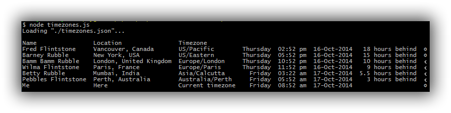

[![MIT License][license-image]][license-url]

# Moment Timezone Difference

A javascript library for displaying information about different timezones, utilising [moment](http://momentjs.com/) and [moment-timezone](http://momentjs.com/timezone/).

If you have a distributed team, you can easily display the current time for each team member
and answer questions such as:
- If the time for me, in Melbourne, Australia, is 2 pm this Sunday, what is the time for Wilma, in Paris, & Fred, in Vancouver.
- If the time for Barney is 5 pm Friday fortnight, what is the time for me and Betty.

# Example

## HTML

An example of its usage is provided at [examples/simple.html](examples/simple.html).

When viewed in a browser, the following is displayed:

You can see it live at [http://madlid.com/moment-timezone-diff/examples/simple.html](http://madlid.com/moment-timezone-diff/examples/simple.html).

## Node.js

An example of its usage is provided at [node/timezone.js](node/timezone.js).

When executed, the following is displayed:

# Documentation

See [DOCUMENTATION.md](DOCUMENTATION.md) for information on its usage.

# License

moment-timezone-diff.js is freely distributable under the terms of the [MIT license](LICENSE).

[license-image]: http://img.shields.io/badge/license-MIT-blue.svg?style=flat
[license-url]: LICENSE
